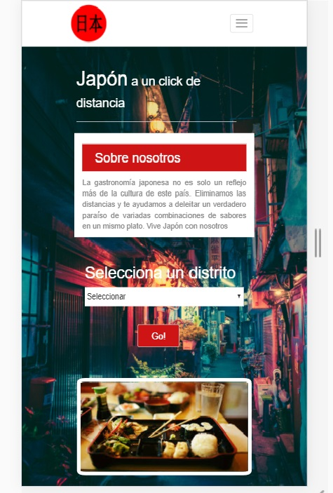

# Proyecto: Aplicación FoodMap

## Descripción del Proyecto:

El siguiente proyecto es el desarrollo de un aplataforma web de búsqueda de restaurantes de comida japonesa. El formato es mobile friendly
La búsqueda se filtra por distrito y se retornan los lugares que coinciden con la búsqueda.
Se brinda información adicional como la descripción del restaurant, imágenes de los platos que se sirven, la dirección y la página web.
El prototipo se ha creado con base a 5 resturantes.

## Arquetipo del usuario:

### Datos:
Nombre: Ari.
Edad: 25 años.
Ocupación: Diseñadora Gráfica
Distrito de residencia: lince.

### Escenario
Ari trabaja de lunes a viernes y los sábados hasta el mediodía. Para relajarse aprovecha los fines de semana para salir con su novio. 
La mayoría de las veces salen a comer. Les gusta a ambos explorar lugares nuevos, especialmente la comdia asiática.
Ella considera que es difícil encontrar lugares de comida asiática, porque no todod tienen una página en fácebook y/o no la mantienen actualizada.

### Frustraciones

- No encuentra diversidad de restaurantes en su distrito.
- La mayoría de restaurantes de comida extranjera son caros.

### Metas:
- Tener su propia empresa.
- Viajar y conocer diferentes culturas.

### Necesidades:
- Encontrar un medio para informarse rápidamente sobre lugares dénde comer.
- Tener disponibilidad de opciones para hacer una elección.

## Flujo de la aplicación:

### Vista index:
La aplicación ofrece primero una vista splash a modo de saludo al usuario, con un gif de un sushi y una frase de saludo. Se escogió la frase "Itadakimasu", porque en la cultura japonesa se utiliza para agradecer por los alimentos que se van a consumir"

### Vista principal:
Luego se redirecciona a la página principal, donde se muestra un pequeño texto sobre lo que ofrece la aplicación. 
Se muestra un select, para que el usuario puede realizar un filtrado de restaurantes según los distritos de Lima Metropolitana.
Además se muestra un slider con imágenes referenciales.
Luego de seleccionar el distrito, con el botón "Go!", se lleva al usuario a la siguiente vista.

### Vista results:
En esta vista se muestran resultados de la búsqueda. Son los restaurantes que se encuentran en el distrito seleccionado. Se ofrecen imágenes (con una animación de cambio de color al darle click), descripción del lugar y el plato especial del día.
Mediante el botón de "Ver detalles", se muestra con un modal información más detallada: direcciónes y el enlace a la página web. Al cerrar el modal,se envía al usuario a la página principal de filtrado.

## Herramientas utilizadas:

1. HTML5

2. JS3

3. jQuery

4. Bootstrap